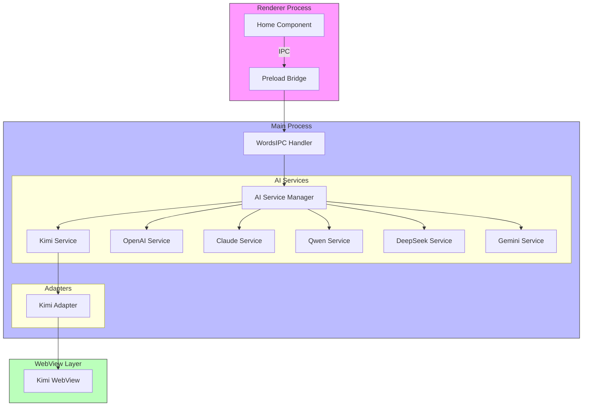

# Application Architecture

## Component Diagram

## Description

This architecture follows a layered approach:

1. **Renderer Process Layer**: Contains the UI components like the Home component which sends messages via IPC
2. **IPC Layer**: Handles inter-process communication between renderer and main processes
3. **Service Management Layer**: AI Service Manager coordinates all AI services
4. **Service Abstraction Layer**: Individual AI services providing a unified interface
5. **Adapter Layer**: Specific adapters for each AI service (example: Kimi Adapter)
6. **WebView Layer**: Actual web views where AI services run

The design encapsulates adapters within services so that consumers only interact with a unified service interface without knowing about the underlying adapter implementation.